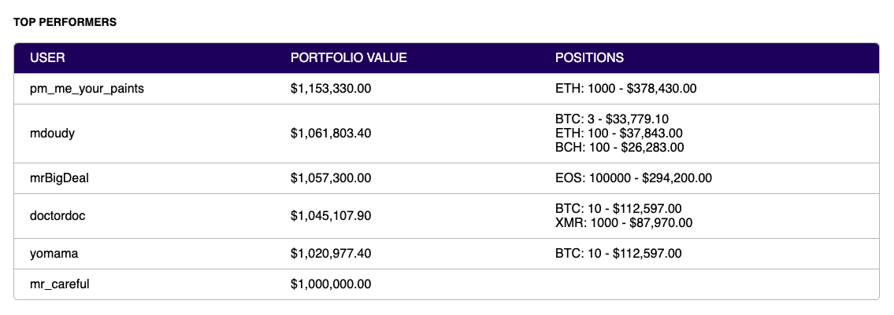

# Crypto Paper Trader
[Live Version](https://cryptic-crag-78444.herokuapp.com/)

This cryptocurrency paper trading app was built during a mini-hackathon over a span of 3 days and eventually migrated from JavaScript to TypeScript.

Live price and symbol specific data is pulled using [CryptoCompare](www.cryptocompare.com)'s API and is fed into an interactive chart display. Users can create accounts and submit buy/sell orders which are persisted in mongoDB. These orders are filled when/if the market price point hits the corresponding open order's value. Users can view and compete against each other's trading strategy results in the leaderboards.


---

## Table of Contents
1. [Installing Dependencies](##Installing-Dependencies)
2. [Tech Stack](##Tech-Stack)
3. [API Used](#API-Used)
4. [Components](##Components)

---

## Installing-Dependencies

### Navigate to the root directory and run the following in your terminal:

>*Install dependencies*
```
npm install
```
>*Run webpack build*
```
npm run build
```
>*Start the server*
```
npm start
```
>*If needed, run the following for development mode*
```
npm run dev
```
Open the file `client/dist/index.html` or `http://localhost:5050` in your browser

---

## Tech-Stack
- [React](https://reactjs.org/)
- [Node.js](nodejs.org)
- [mongoDB](https://www.mongodb.com/)
- [TypeScript](https://www.typescriptlang.org/)
- [Express](http://expressjs.com/)

---

## API-Used
www.cryptocompare.com

---

## Components

### Charts
>Live streaming charts and data with the option to toggle between daily, hourly, minute views, candlestick/line chart type, and volume display


### Order Placement Module
>Submit buy/sell orders / Displays account overview, current positions, and open unfilled orders


### Quotes
>Displays all users' open unfilled and filled orders


### Leaderboard
>Displays top performing users, their portfolio value, and their positions

